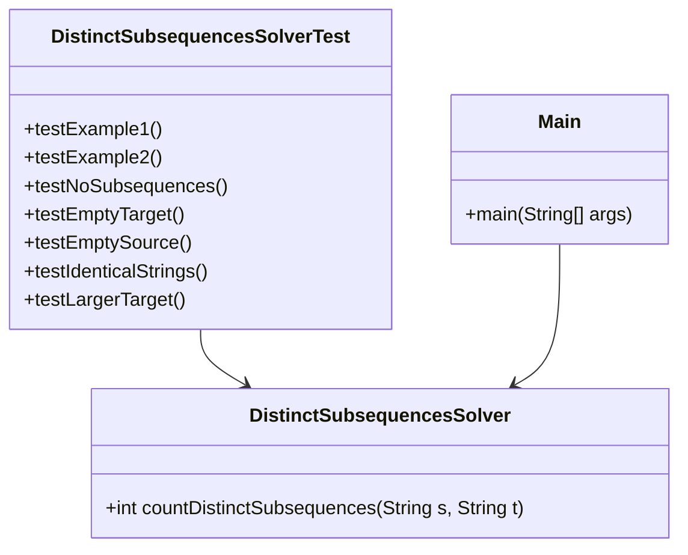

# Distinct Subsequences Solver

## Descripción
Este proyecto implementa una solución eficiente para el problema ["Distinct Subsequences"](https://leetcode.com/problems/distinct-subsequences/) de LeetCode.  
El código sigue principios de **modularidad, extensibilidad y mantenibilidad**, asumiendo que podría ser usado en un sistema de producción.

## Enfoque de la Solución
Se utiliza **Programación Dinámica (DP)** para reducir la complejidad del problema a **O(m * n)**, mejorando rendimiento en comparación con una solución recursiva ingenua (**O(2^m)**).  

- **dp[i][j]** representa el número de formas en que `t[0..j-1]` aparece como subsecuencia en `s[0..i-1]`.  
- Se construye una **tabla DP** donde cada valor se calcula en función de decisiones óptimas previas.  
- Se evita recursión y se optimiza el uso de memoria.

---

## Estructura del Proyecto

- distinct-subsequences/
  - src/
    - main/java/com/example/
      - `DistinctSubsequencesSolver.java` → Lógica de negocio
      - `Main.java` → Punto de entrada
    - test/java/com/example/test/
      - `DistinctSubsequencesSolverTest.java` → Pruebas unitarias
  - `pom.xml` → Configuración de Maven
  - `README.md` → Documentación del proyecto

---

## Arquitectura del Proyecto

---

## Despliegue y Uso

mvn compile exec:java -Dexec.mainClass="com.example.Main"

---

## Ejecutar Pruebas

mvn test

